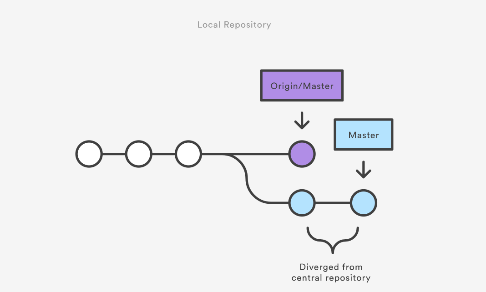

Introduction of git workflow 
===========================

Overview
------------
**Workflow** is a powerful automation which combines a bunch of steps in one simple set.

A Git Workflow is a recipe or recommendation for how to use Git to accomplish work in a consistent and productive manner. Git workflows encourage users to leverage Git effectively and consistently.

Example: Centralized Workflow
-----------------------------
The Centralized Workflow is a great Git workflow for teams transitioning from SVN. Like Subversion, the Centralized Workflow uses a central repository to serve as the single point-of-entry for all changes to the project.

How it works
------------
Developers start by cloning the central repository. In their own local copies of the project, they edit files and commit changes as they would with SVN; however, these new commits are stored locally - they’re completely isolated from the central repository. This lets developers defer synchronizing upstream until they’re at a convenient break point.

To publish changes to the official project, developers "push" their local master branch to the central repository. This is the equivalent of svn commit, except that it adds all of the local commits that aren’t already in the central master branch.


### 1. Initialize the central repository
------------
First, someone needs to create the central repository on a server. If it’s a new project, you can initialize an empty repository. Otherwise, you’ll need to import an existing Git or SVN repository.

Central repositories should always be bare repositories (they shouldn’t have a working directory), which can be created as follows:
 ```
git init --bare /path/to/repo.git
 ```
Note that the .git extension is conventionally appended to the repository name to indicate that it’s a bare repository.

### 2. Clone the central repository
------------
Next, each developer creates a local copy of the entire project. This is accomplished via the git clone command:
 ```
git clone ssh://user@host/path/to/repo.git
 ```
When you clone a repository, Git automatically adds a shortcut called origin that points back to the “parent” repository, under the assumption that you'll want to interact with it further on down the road. 


### 3. Gitflow Work
------------
Make changes and commit
Once the repository is cloned locally, a developer can make changes using the standard Git commit process: edit, stage, and commit. If you’re not familiar with the staging area, it’s a way to prepare a commit without having to include every change in the working directory. This lets you create highly focused commits, even if you’ve made a lot of local changes.
 ```
git status # View the state of the repo
git add <some-file> # Stage a file
git commit # Commit a file</some-file>
 ```
Remember that since these commands create local commits, John can repeat this process as many times as he wants without worrying about what’s going on in the central repository. 


### 4. Push new commits to central repository
-------------
Once the local repository has new changes committed. These change will need to be pushed to share with other developers on the project.
 ```
git push origin master
 ```
This command will push the new committed changes to the central repository. When pushing changes to the central repository, it is possible that updates from another developer have been previously pushed that contain code which conflict with the intended push updates. Git will output a message indicating this conflict. In this situation, git pull will first need to be executed.

### 5. Managing conflicts
------------
The central repository represents the official project, so its commit history should be treated as sacred and immutable. If a developer’s local commits diverge from the central repository, Git will refuse to push their changes because this would overwrite official commits.


Before the developer can publish their feature, they need to fetch the updated central commits and rebase their changes on top of them. This is like saying, “I want to add my changes to what everyone else has already done.” The result is a perfectly linear history, just like in traditional SVN workflows.

If local changes directly conflict with upstream commits, Git will pause the rebasing process and give you a chance to manually resolve the conflicts. The nice thing about Git is that it uses the same git status and git add commands for both generating commits and resolving merge conflicts. This makes it easy for new developers to manage their own merges. Plus, if they get themselves into trouble, Git makes it very easy to abort the entire rebase and try again (or go find help).

Summary
--------
There is no one size fits all Git workflow. As previously stated, it’s important to develop a Git workflow that is a productivity enhancement for your team. If you want good examples of git workflow, take a look at [here](https://www.atlassian.com/git/tutorials/comparing-workflows "git workflow tutorial").